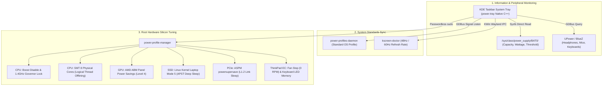

# ⚡ ThinkPower

[](https://github.com/jedclub/thinkpower/releases/latest)
[](https://github.com/jedclub/thinkpower/actions/workflows/ci.yml)
[](https://opensource.org/licenses/MIT)
[-orange.svg)]()
[]()
[]()
[]()
[]()
[]()

> **Advanced 4-Stage Hardware Power Profile & Battery Management Tray for Linux**  
> Tailored for **ThinkPad** and **AMD Ryzen (Zen 2/3/4/5 Renoir/Cezanne/Phoenix)** laptops running **KDE Plasma 6 (Wayland)**.

---

## 🌟 Overview

Default Linux desktop power managers only set high-level ACPI platform hints. Under the hood, modern processors still boost frequencies to 4.1GHz+ at 1.35V+ for brief background tasks, keeping fans spinning and draining batteries rapidly.

**ThinkPower** bridges this gap: it serves as an all-in-one replacement for the default desktop battery widget, introducing a **Dual-Layer Architecture** that synchronizes with the OS standard (`power-profiles-daemon`) while taking direct control over silicon voltage, bus sleep states, display scanout frequencies, and peripheral hardware.

```text
┌──────────────────────────────────────────────────┐
│  🔋 배터리 76% (충전 중)                         │
│                                                  │
│  ⚡ 충전량 : +21.5W                               │
│  ⏳ 충전예상 : 80%까지 약 5분                     │
│  ⚙️ 전원모드 : 🍃 스마트 절전 (1.7GHz)             │
│  🛡️ 보호한도 : 80% (수명 보호)                   │
│  🩺 배터리건강 : 94.2% (88회)                     │
│  🎧 Bluetooth Earphones : 80%                    │
│  📡 무선상태 : Wi-Fi · BT On                     │
└──────────────────────────────────────────────────┘
```

---

## 🖥️ UI & Desktop Integration

<div align="center">
  
  <p><em>Real-time battery percentage, charging/discharging wattage, and status indicator on the KDE Plasma panel.</em></p>
</div>

<div align="center">
  <table border="0">
    <tr>
      <td align="center" width="55%">
        
        <br />
        <em>HUD Tooltip with live wattage, battery health, threshold time, and Bluetooth peripherals</em>
      </td>
      <td align="center" width="45%">
        
        <br />
        <em>Native context menu with 4-stage profile selection & Quick Actions</em>
      </td>
    </tr>
  </table>
</div>

---

## ✨ Key Features

- 🔋 **All-In-One Battery Tray Replacement**: Displays live battery %, charging/discharging wattage (`+`/`-`), and accurate remaining time directly on your KDE taskbar panel.
- 🏛️ **Dual-Layer State Machine**: 
  - Standard OS sees standard `power-saver`, `balanced`, and `performance`.
  - ThinkPower provides an extra **🛡️ Ultra Save** hardware lockdown without breaking OS specification compliance.
- ⚡ **Real-Time Wattage Flow (+/-)**:
  - **`+` (Inflow / Charging)**: Wattage entering the battery from the charger (e.g. `⚡ 45% (+31.2W)`).
  - **`-` (Outflow / Discharging)**: Real-time system power consumption (e.g. ` 45% (-10.5W)`).
- 🛡️ **ThinkPad Battery Conservation Mode**:
  - Automatically detects hardware battery charge limits (typically 80%).
  - Calculates remaining charging time **specifically to the protection limit**, not a fictitious 100%.
- 🎧 **Bluetooth & Wireless Peripheral Battery Monitoring**:
  - Auto-discovers connected Bluetooth headphones, mice, keyboards, and game controllers via UPower & BlueZ.
- 📏 **Non-Wrapping Clean HUD Tooltip**:
  - Typography constrained to strictly fit within the KDE StatusNotifierItem popup width without line wraps.
- 💡 **Automatic Keyboard Backlight Memory**:
  - Caches current keyboard light brightness before entering Ultra Save, and automatically restores it when returning to normal profiles.
- 📶 **Zero Connectivity Loss Guarantee**:
  - Wi-Fi, Bluetooth, input devices, and audio remain 100% active in all profiles.

---

## 📊 Profile Comparison

| Profile | CPU Clock Floor/Cap | Threads | Screen Mode | AMD ABM | Fan Target | Typical Power |
| :--- | :--- | :--- | :--- | :--- | :--- | :--- |
| **⚡ Performance** | Up to 4.1GHz Boost | 16T | 60Hz | Level 0 | Max Airflow | 25W ~ 40W |
| **⚖️ Balanced** | Dynamic 1.4 ~ 4.1GHz | 16T | 60Hz | Level 1 | Balanced | 12W ~ 22W |
| **🍃 Smart Save** | **1.7GHz Max (No Boost)** | **16T** | **60Hz** | **Level 2** | **Silent / Low** | **8W ~ 10W** |
| **🛡️ Ultra Save** | **1.4GHz Locked (Max Cap)** | **4T (4C Parking)** | **48Hz / 24FPS & 20% Bright** | **Level 4 + GPU Low + No Blur/Anim** | **0 RPM (Off)** | **~3W Target** |

---

## 🏛️ Architecture



---

## 📁 Repository Layout

```
thinkpower/
├── .github/workflows/               # GitHub Actions CI/CD workflows (PGO + multi-packaging)
├── .gitignore
├── LICENSE                          # MIT License
├── README.md                        # Master Documentation
├── Makefile                         # High-performance native build script (PGO/LTO/AVX2)
├── CMakeLists.txt                   # Standard CMake configuration
├── PKGBUILD                         # Arch Linux & CachyOS native package recipe
├── install.sh                       # One-Click Builder & Installer
├── uninstall.sh                     # Clean Uninstaller
├── packaging/                       # Distribution packaging tools (.deb, .pkg.tar.zst)
│   └── build-deb.sh                 # High-performance .deb builder
├── src/
│   ├── power-tray.cpp               # Native C++17 AyatanaAppIndicator Tray Applet
│   ├── power-profile-manager        # Privileged Hardware Silicon Tuner
│   └── config/
│       ├── power-tray.service       # systemd user service unit
│       ├── power-tray.desktop       # XDG Autostart entry
│       ├── power-ultra.desktop      # KDE Application Launcher shortcut
│       └── 99-power-profile-manager # Sudoers passwordless rule
└── docs/
    ├── images/                      # High-DPI screenshots & UI previews
    ├── 01-ARCHITECTURE.md           # Deep dive into dual-layer state machine
    ├── 02-HARDWARE-TUNING.md        # Sysfs registers, ASPM, ABM, and CPU floors
    ├── 03-FEATURES-GUIDE.md         # Comprehensive features and usage guide
    └── 04-TROUBLESHOOTING.md        # Permissions, dependencies, and debugging
```

---

## 🚀 Installation

### 📦 Pre-built Packages (Quick Install)

Pre-compiled and optimized packages are automatically built and published with every release:

👉 **[Download Latest Release (v1.0.0)](https://github.com/jedclub/thinkpower/releases/latest)**

| Target Distribution | Package Format | Direct One-Line Installation |
| :--- | :---: | :--- |
| **🚀 CachyOS / Arch Linux** (Primary) | **`.pkg.tar.zst`** | `sudo pacman -U thinkpower-1.0.0-1-x86_64.pkg.tar.zst` |
| **Debian / Ubuntu / Mint** | **`.deb`** | `sudo apt install ./thinkpower_1.0.0_amd64.deb` |
| **Generic Linux (Any Distro)** | **`.tar.gz`** | Extract & run `./install.sh` |

---

### 🛠️ Build from Source

#### 1. Prerequisites

Make sure the following build and runtime packages are installed on your distribution:

**Arch Linux / CachyOS / Manjaro**:
```bash
sudo pacman -S base-devel cmake gcc pkgconf libayatana-appindicator gtk3 glib2 power-profiles-daemon upower libnotify
```

**Fedora**:
```bash
sudo dnf install gcc-c++ make cmake pkgconfig libayatana-appindicator-devel gtk3-devel glib2-devel power-profiles-daemon upower libnotify
```

**Debian / Ubuntu**:
```bash
sudo apt install build-essential cmake pkg-config libayatana-appindicator3-dev libgtk-3-dev libglib2.0-dev power-profiles-daemon upower libnotify-bin
```

### 2. Native Package Installation (Arch Linux / CachyOS / Manjaro)

The recommended installation method on Arch-based distributions is using the native pacman package with **PGO (Profile-Guided Optimization) + AVX2 + LTO**:

```bash
# 1. Build the native package (runs 500,000 profiling iterations & builds .pkg.tar.zst)
make pkg

# 2. Install using pacman
sudo pacman -U thinkpower-1.0.0-1-x86_64.pkg.tar.zst

# 3. Enable and start the user tray daemon
systemctl --user enable --now power-tray.service
```

### 3. Debian / Ubuntu / Linux Mint / Pop!_OS (.deb)

```bash
# 1. Build .deb package (with PGO + AVX2 + LTO)
make deb

# 2. Install using apt
sudo apt install ./release/thinkpower_1.0.0_amd64.deb

# 3. Enable and start user daemon
systemctl --user enable --now power-tray.service
```

### 4. Universal Release Packages & All-In-One Build

To generate all distribution packages with extreme optimization in one command:

```bash
make release
```

This automatically generates all release artifacts in `release/`:
- **`thinkpower-1.0.0-1-x86_64.pkg.tar.zst`**: Native Arch Linux & CachyOS package.
- **`thinkpower_1.0.0_amd64.deb`**: Debian & Ubuntu package.
- **`thinkpower-1.0.0-linux-x86_64.tar.gz`**: Universal portable distribution archive with standalone installer.
- **`SHA256SUMS.txt`**: Cryptographic integrity checksums.

### 5. Local Quick Script Install

Alternatively, build and install directly to `~/.local/bin/` without packaging:

```bash
./install.sh
```

---

## 🗑️ Uninstallation

**If installed via pacman package:**
```bash
systemctl --user disable --now power-tray.service
sudo pacman -R thinkpower
```

**If installed via `install.sh`:**
```bash
./uninstall.sh
```

---

## 📚 Technical Documentation

For detailed technical specifications, explore the `docs/` directory:
- [01-ARCHITECTURE.md](docs/01-ARCHITECTURE.md) — Dual-layer state machine and D-Bus synchronization.
- [02-HARDWARE-TUNING.md](docs/02-HARDWARE-TUNING.md) — Complete sysfs register and kernel parameter reference.
- [03-FEATURES-GUIDE.md](docs/03-FEATURES-GUIDE.md) — Detailed feature breakdown and usage guide.
- [04-TROUBLESHOOTING.md](docs/04-TROUBLESHOOTING.md) — Troubleshooting, permissions, and debugging tips.

---

## 📄 License

This project is licensed under the [MIT License](LICENSE).
