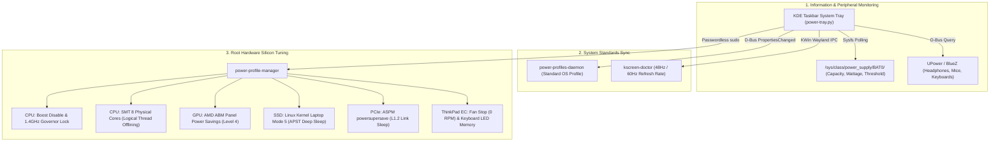

# ⚡ ThinkPower

[](https://opensource.org/licenses/MIT)
[-orange.svg)]()
[]()
[]()
[]()

> **Advanced 4-Stage Hardware Power Profile & Battery Management Tray for Linux**  
> Tailored for **ThinkPad** and **AMD Ryzen (Zen 2/3/4/5 Renoir/Cezanne/Phoenix)** laptops running **KDE Plasma 6 (Wayland)**.

---

## 🌟 Overview

Default Linux desktop power managers only set high-level ACPI platform hints. Under the hood, modern processors still boost frequencies to 4.1GHz+ at 1.35V+ for brief background tasks, keeping fans spinning and draining batteries rapidly.

**ThinkPower** bridges this gap: it serves as an all-in-one replacement for the default desktop battery widget, introducing a **Dual-Layer Architecture** that synchronizes with the OS standard (`power-profiles-daemon`) while taking direct control over silicon voltage, bus sleep states, display scanout frequencies, and peripheral hardware.

```text
┌──────────────────────────────────────────────────┐
│  🔋 배터리 76% (충전 중)                         │
│                                                  │
│  ⚡ 충전량 : +21.5W                               │
│  ⏳ 충전예상 : 80%까지 약 5분                     │
│  ⚙️ 전원모드 : 🍃 스마트 절전 (1.7GHz)             │
│  🛡️ 보호한도 : 80% (수명 보호)                   │
│  🩺 배터리건강 : 94.2% (88회)                     │
│  🎧 Bluetooth Earphones : 80%                    │
│  📡 무선상태 : Wi-Fi · BT On                     │
└──────────────────────────────────────────────────┘
```

---

## ✨ Key Features

- 🔋 **All-In-One Battery Tray Replacement**: Displays live battery %, charging/discharging wattage (`+`/`-`), and accurate remaining time directly on your KDE taskbar panel.
- 🏛️ **Dual-Layer State Machine**: 
  - Standard OS sees standard `power-saver`, `balanced`, and `performance`.
  - ThinkPower provides an extra **🛡️ Ultra Save** hardware lockdown without breaking OS specification compliance.
- ⚡ **Real-Time Wattage Flow (+/-)**:
  - **`+` (Inflow / Charging)**: Wattage entering the battery from the charger (e.g. `⚡ 45% (+31.2W)`).
  - **`-` (Outflow / Discharging)**: Real-time system power consumption (e.g. ` 45% (-10.5W)`).
- 🛡️ **ThinkPad Battery Conservation Mode**:
  - Automatically detects hardware battery charge limits (typically 80%).
  - Calculates remaining charging time **specifically to the protection limit**, not a fictitious 100%.
- 🎧 **Bluetooth & Wireless Peripheral Battery Monitoring**:
  - Auto-discovers connected Bluetooth headphones, mice, keyboards, and game controllers via UPower & BlueZ.
- 📏 **Non-Wrapping Clean HUD Tooltip**:
  - Typography constrained to strictly fit within the KDE StatusNotifierItem popup width without line wraps.
- 💡 **Automatic Keyboard Backlight Memory**:
  - Caches current keyboard light brightness before entering Ultra Save, and automatically restores it when returning to normal profiles.
- 📶 **Zero Connectivity Loss Guarantee**:
  - Wi-Fi, Bluetooth, input devices, and audio remain 100% active in all profiles.

---

## 📊 Profile Comparison

| Profile | CPU Clock Floor/Cap | Threads | Screen Mode | AMD ABM | Fan Target | Typical Power |
| :--- | :--- | :--- | :--- | :--- | :--- | :--- |
| **⚡ Performance** | Up to 4.1GHz Boost | 16T | 60Hz | Level 0 | Max Airflow | 25W ~ 40W |
| **⚖️ Balanced** | Dynamic 1.4 ~ 4.1GHz | 16T | 60Hz | Level 1 | Balanced | 12W ~ 22W |
| **🍃 Smart Save** | **1.7GHz Max (No Boost)** | **16T** | **60Hz** | **Level 2** | **Silent / Low** | **8W ~ 10W** |
| **🛡️ Ultra Save** | **1.4GHz Locked** | **8T (SMT Off)**| **48Hz** | **Level 4** | **0 RPM (Off)** | **4.5W ~ 5.5W** |

---

## 🏛️ Architecture



---

## 📁 Repository Layout

```
thinkpower/
├── .gitignore
├── LICENSE                          # MIT License
├── README.md                        # Master Documentation
├── install.sh                       # One-Click Installer
├── uninstall.sh                     # Clean Uninstaller
├── src/
│   ├── power-tray.py                # Main GTK3 / AyatanaAppIndicator Tray Applet
│   ├── power-profile-manager        # Privileged Hardware Silicon Tuner
│   └── config/
│       ├── power-tray.service       # systemd user service unit
│       ├── power-tray.desktop       # XDG Autostart entry
│       ├── power-ultra.desktop      # KDE Application Launcher shortcut
│       └── 99-power-profile-manager # Sudoers passwordless rule
└── docs/
    ├── 01-ARCHITECTURE.md           # Deep dive into dual-layer state machine
    ├── 02-HARDWARE-TUNING.md        # Sysfs registers, ASPM, ABM, and CPU floors
    ├── 03-FEATURES-GUIDE.md         # Comprehensive features and usage guide
    └── 04-TROUBLESHOOTING.md        # Permissions, dependencies, and debugging
```

---

## 🚀 Installation

### 1. Prerequisites

Make sure the following runtime packages are installed on your distribution:

**Arch Linux / CachyOS / Manjaro**:
```bash
sudo pacman -S python-gobject libayatana-appindicator power-profiles-daemon upower libnotify
```

**Fedora**:
```bash
sudo dnf install python3-gobject libayatana-appindicator power-profiles-daemon upower libnotify
```

**Debian / Ubuntu**:
```bash
sudo apt install python3-gi gir1.2-ayatanaappindicator3-0.1 power-profiles-daemon upower libnotify-bin
```

### 2. Quick Install

Clone the repository and run the installer:

```bash
git clone https://github.com/your-username/thinkpower.git
cd thinkpower
./install.sh
```

The installer will:
1. Place `power-tray.py` in `~/.local/bin/`.
2. Install `power-profile-manager` in `/usr/local/bin/`.
3. Configure the passwordless sudoers drop-in in `/etc/sudoers.d/99-power-profile-manager`.
4. Register and start the `power-tray.service` systemd user service.
5. Create desktop entries in `~/.config/autostart/` and `~/.local/share/applications/`.

---

## 🗑️ Uninstallation

To cleanly remove all ThinkPower components and restore default OS power behavior:

```bash
cd thinkpower
./uninstall.sh
```

---

## 📚 Technical Documentation

For detailed technical specifications, explore the `docs/` directory:
- [01-ARCHITECTURE.md](docs/01-ARCHITECTURE.md) — Dual-layer state machine and D-Bus synchronization.
- [02-HARDWARE-TUNING.md](docs/02-HARDWARE-TUNING.md) — Complete sysfs register and kernel parameter reference.
- [03-FEATURES-GUIDE.md](docs/03-FEATURES-GUIDE.md) — Detailed feature breakdown and usage guide.
- [04-TROUBLESHOOTING.md](docs/04-TROUBLESHOOTING.md) — Troubleshooting, permissions, and debugging tips.

---

## 📄 License

This project is licensed under the [MIT License](LICENSE).
