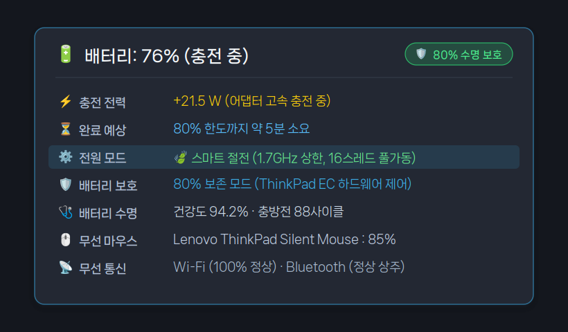
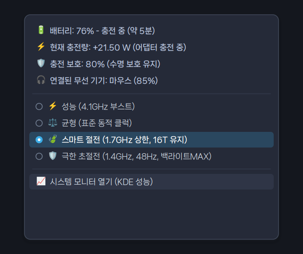
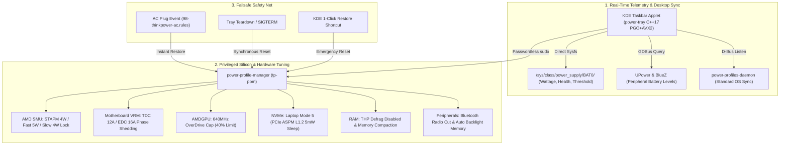

# ⚡ ThinkPower

[](https://github.com/jedclub/thinkpower/releases/latest)
[](https://github.com/jedclub/thinkpower/actions/workflows/ci.yml)
[](https://opensource.org/licenses/MIT)
[-orange.svg)]()
[]()
[]()
[]()
[]()
[]()

> **Advanced 4-Stage Hardware Silicon Power Management & Battery Protection Tray for Linux**  
> Tailored and deeply tuned for **ThinkPad L15 Gen 1 (AMD Ryzen 7 PRO 4750U Renoir)** running **CachyOS / Arch Linux on KDE Plasma 6 (Wayland)**.

---

> [!IMPORTANT]
> ### 💻 Machine-Specific Optimization Notice
> **ThinkPower is personally customized, benchmarked, and hardware-tuned specifically for the author's daily-driver notebook:**
> - **Model**: Lenovo ThinkPad L15 Gen 1 (AMD) [Type 20U7]
> - **Processor**: AMD Ryzen 7 PRO 4750U (8 Cores / 16 Threads, Zen 2 Renoir APU, 1.4GHz base ~ 4.1GHz boost)
> - **Graphics**: Integrated AMD Radeon Vega 7 Graphics
> - **Storage**: Samsung SSD 980 PRO (PCIe NVMe M.2)
> - **Memory**: DDR4-3200 SODIMM
> - **Display**: 15.6" FHD (1920x1080 @ 60Hz IPS)
> - **OS & Kernel**: CachyOS (Arch Linux-based, BORE/EEVDF kernel) on KDE Plasma 6 Wayland
>
> *Note for other devices*: While the architecture and tray applet work broadly across ThinkPads and Linux distributions, the low-level silicon tuning parameters (AMD SMU registers, 4W STAPM TDP lock, VRM 12A/16A current clamping, GPU 640MHz OverDrive, PCIe paths, and ThinkPad EC registers) are calibrated specifically for this hardware configuration.

---

## 🌟 Overview

Standard desktop power management tools (`power-profiles-daemon`, `tlp`) operate primarily through ACPI governor hints. Under the hood, modern processors still boost clocks to 4.1GHz+ at 1.35V+ for ephemeral background tasks, keeping cooling fans spinning, spiking VRM switching losses, and rapidly draining battery capacity.

**ThinkPower** fundamentally solves this through a **Dual-Layer Architecture**:
1. **Desktop System Tray Applet (`power-tray`)**: A native, hyper-optimized C++17 tray daemon compiled with **PGO (Profile-Guided Optimization) + AVX2 SIMD + LTO** consuming only ~8MB of RAM. It provides real-time battery inflow/outflow wattage, remaining charge time estimation to battery conservation limits (80%), Bluetooth peripheral battery levels, and seamless integration into the KDE Plasma taskbar.
2. **Direct Hardware Silicon & Motherboard Tuner (`power-profile-manager` / `tp-ppm`)**: A privileged hardware controller that interfaces directly with the **AMD SMU (System Management Unit) co-processor**, motherboard VRM phase controllers, GPU OverDrive clocks, NVMe autonomous power states, and PCIe ASPM links.

```text
┌──────────────────────────────────────────────────┐
│  🔋 배터리 35% (사용 중)                         │
│                                                  │
│  ⚡ 소비전력 : -6.52W                             │
│  ⏳ 예상시간 : 약 5시간 40분                      │
│  ⚙️ 전원모드 : 🛡️ 초절전 (SMU 4W · VRM 12A)       │
│  🛡️ 보호한도 : 80% (수명 보호 활성)               │
│  🩺 배터리건강 : 94.2%                            │
│  📡 무선상태 : Wi-Fi On · BT Off                 │
│  📊 SMU TDP  : 4.000W STAPM Hardware Lock        │
└──────────────────────────────────────────────────┘
```

---

## 🖥️ UI & Desktop Integration

<div align="center">
  
  <p><em>Real-time battery percentage, charging/discharging wattage, and status indicator on the KDE Plasma panel.</em></p>
</div>

<div align="center">
  <table border="0">
    <tr>
      <td align="center" width="55%">
        
        <br />
        <em>HUD Tooltip with live wattage, battery health, threshold time, and Bluetooth peripherals</em>
      </td>
      <td align="center" width="45%">
        
        <br />
        <em>Native context menu with 4-stage profile selection & Quick Actions</em>
      </td>
    </tr>
  </table>
</div>

---

## ✨ Key Features in v1.1.0

### 1. ⚡ Direct AMD SMU Hardware TDP Clamping
- In **Ultra Save** mode, bypasses OS software governors and directly commands the **AMD SMU co-processor**:
  - **STAPM Limit**: Clamped to **`4.000W`**
  - **Fast PPT Limit**: Clamped to **`5.000W`**
  - **Slow PPT Limit**: Clamped to **`4.000W`**
  - **Thermal Limit**: Clamped to **`60°C`**
- All 16 threads (8C / 16T) remain online and fully responsive with SMT active (no thread offlining, zero UI stuttering).

### 2. 🎮 GPU 40% OverDrive Frequency Cap (640MHz)
- Locks the Radeon Vega 7 iGPU clock to a strict **40% ceiling (640MHz)** via AMDGPU OverDrive (`pp_od_clk_voltage`).
- Allows dynamic DPM scaling between **200MHz** (idle) and **640MHz** (load), preventing 1600MHz GPU power surges while keeping 60Hz Wayland compositing butter-smooth.

### 3. 🔌 Motherboard & VRM Hardware Power Control
- **VRM Phase Shedding (PSI0 / TDC / EDC Clamping)**:
  - Clamps continuous thermal current (TDC) from 44A down to **`12.0A`**.
  - Clamps peak electrical current (EDC) from 70A down to **`16.0A`**.
  - Triggers **PSI0 (Power State Indicator)** to drop multi-phase VRM into **1-Phase low-power sleep mode**, slashing MOSFET switching and inductor ripple heat losses.
- **PCIe & USB Bus Runtime PM**: Forces `auto` (D3hot sleep) across all PCIe bridges, endpoints, MicroSD card reader (`sdhci-pci`), Goodix fingerprint scanner, and integrated webcam.
- **HD Audio Controller Sleep**: Puts the PCI audio bus controller into D3hot state (`power_save_controller=Y`).
- **Interrupt & Timer Coalescing**: Disables NMI watchdog (`nmi_watchdog=0`), enables power-efficient workqueues, and consolidates timer wakeups (`timer_migration=1`).

### 4. 💾 NVMe SSD & RAM Deep Sleep Tuning
- **Kernel Laptop Mode 5**: Sets `vm.laptop_mode = 5` and extends dirty writeback intervals to 30s/60s (`dirty_expire_centisecs = 6000`).
- Allows the **Samsung 980 PRO NVMe SSD** to stay in **PCIe ASPM L1.2 sub-5mW ultra-deep sleep** for prolonged periods without waking the NAND flash.
- **RAM THP Optimization**: Disables Transparent Hugepage defragmentation (`defrag = never`, `khugepaged/defrag = 0`) to eliminate high-frequency memory compaction interrupts.

### 5. 📻 Bluetooth Radio Hardware Cut & Safe Recovery
- In Ultra Save mode, completely blocks Bluetooth radio emissions (`rfkill block bluetooth`), eliminating ~0.2W~0.3W of idle transceiver power.
- Automatically saves prior Bluetooth state and restores radio power on profile exit.

### 6. 🛡️ Multi-Layered Failsafe Recovery Architecture
- **Automatic AC Charger Recovery**: Immediate failsafe restore to `balanced` mode upon AC power plug-in via udev rules (`98-thinkpower-ac.rules`) and tray D-Bus listeners.
- **Clean Boot ID Tracking**: Detects fresh reboots via `/proc/sys/kernel/random/boot_id`, purging stale cache files and ensuring the system always boots cleanly into safe defaults.
- **Synchronous Tray Teardown**: Ensures hardware limits (25W TDP, 44A/70A VRM, 1600MHz GPU) are completely restored before the tray daemon process exits.
- **1-Click Failsafe Launcher**: Includes a dedicated KDE Application Launcher shortcut (`power-restore.desktop`) for emergency hardware reset.

### 7. 📊 Live Component-Level Power Analyzer (`tp-ppm analyze`)
- Run `tp-ppm analyze` at any time to inspect live, real-time power consumption broken down by silicon component:
  - Battery discharge power (`BAT0`)
  - AMD APU SoC Package & Core compute power (RAPL)
  - SMU co-processor telemetry (STAPM, Fast/Slow PPT, TDC/EDC currents, temperature)
  - Display panel logic + LED backlight power
  - Cooling fan wattage based on live RPM
  - DDR4 RAM, Wi-Fi 6, NVMe SSD, and motherboard VRM conversion losses

---

## 📊 Profile Comparison

| Setting / Component | ⚡ Performance | ⚖️ Balanced (Default) | 🍃 Smart Save | 🛡️ Ultra Save (Extreme) |
| :--- | :--- | :--- | :--- | :--- |
| **CPU Clock & Boost** | Dynamic (Up to 4.1GHz) | Dynamic (1.4 ~ 4.1GHz) | Max 1.7GHz (Boost OFF) | **Max 1.4GHz (Boost OFF)** |
| **Threads & SMT** | 16 Threads (SMT ON) | 16 Threads (SMT ON) | 16 Threads (SMT ON) | **16 Threads (SMT ON)** |
| **AMD SMU STAPM Limit**| 25.0W (OEM Unlocked) | 18.0W | 10.0W | **4.000W Hardware Lock** |
| **Fast / Slow PPT** | 30W / 25W | 22W / 18W | 12W / 10W | **5.0W / 4.0W** |
| **VRM Current (TDC/EDC)**| 44A / 70A (Full) | 35A / 55A | 25A / 35A | **12.0A / 16.0A (1-Phase)** |
| **iGPU Max Clock** | 1600MHz | 1600MHz | 1600MHz | **640MHz Cap (40% Lock)** |
| **Display Brightness** | User set | User set | User set | **20% Cap (Auto Memory)** |
| **KWin / Wayland FPS** | 60Hz Smooth | 60Hz Smooth | 60Hz Smooth | **60Hz Smooth (No Stutter)** |
| **ThinkPad EC Profile**| `performance` | `balanced` | `low-power` | **`low-power` (Silent Fan)** |
| **Bluetooth Radio** | ON | ON | ON | **OFF (Hardware Block)** |
| **Kernel Laptop Mode** | 0 (Normal) | 0 (Normal) | 0 (Normal) | **5 (NVMe ASPM L1.2 5mW)** |
| **Typical Power Draw** | 18W ~ 35W | 10W ~ 16W | 8W ~ 11W | **6.5W ~ 8.5W** |

---

## 🏛️ Architecture



---

## 📁 Repository Layout

```
thinkpower/
├── .github/workflows/               # GitHub Actions CI/CD workflows (PGO + multi-packaging)
├── .gitignore
├── LICENSE                          # MIT License
├── README.md                        # Master Documentation
├── Makefile                         # High-performance native build script (PGO/LTO/AVX2)
├── CMakeLists.txt                   # Standard CMake configuration
├── PKGBUILD                         # Arch Linux & CachyOS native package recipe
├── install.sh                       # One-Click Builder & Installer
├── uninstall.sh                     # Clean Uninstaller
├── packaging/                       # Packaging tools and desktop integrations
│   ├── build-deb.sh                 # Debian package (.deb) builder
│   ├── power-tray.service           # systemd user service unit
│   ├── power-tray.desktop           # XDG Autostart entry
│   ├── power-ultra.desktop          # KDE Application Launcher shortcut (Ultra Save)
│   ├── power-restore.desktop        # KDE 1-Click Emergency Failsafe Restore shortcut
│   └── thinkpower.install           # Arch package post-install script
├── src/
│   ├── power-tray.cpp               # Native C++17 AyatanaAppIndicator Tray Applet
│   ├── power-profile-manager        # Privileged Hardware Silicon & Motherboard Tuner (tp-ppm)
│   └── config/
│       ├── 98-thinkpower-ac.rules   # Udev rule for automatic charger restore
│       └── 99-power-profile-manager # Sudoers passwordless rule
└── docs/
    ├── images/                      # High-DPI screenshots & UI previews
    ├── 01-ARCHITECTURE.md           # Deep dive into dual-layer state machine
    ├── 02-HARDWARE-TUNING.md        # Sysfs registers, ASPM, ABM, and CPU floors
    ├── 03-FEATURES-GUIDE.md         # Comprehensive features and usage guide
    └── 04-TROUBLESHOOTING.md        # Permissions, dependencies, and debugging
```

---

## 🚀 Installation

### 📦 Pre-built Packages (Recommended)

Pre-compiled and optimized packages are automatically built with PGO and published with every release:

👉 **[Download Latest Release (v1.1.0)](https://github.com/jedclub/thinkpower/releases/latest)**

| Target Distribution | Package Format | Direct One-Line Installation |
| :--- | :---: | :--- |
| **🚀 CachyOS / Arch Linux** (Primary) | **`.pkg.tar.zst`** | `sudo pacman -U thinkpower-1.1.0-1-x86_64.pkg.tar.zst` |
| **Debian / Ubuntu / Mint** | **`.deb`** | `sudo apt install ./thinkpower_1.1.0_amd64.deb` |
| **Generic Linux (Any Distro)** | **`.tar.gz`** | Extract & run `./install.sh` |

---

### 🛠️ Build from Source

#### 1. Prerequisites

Make sure the following build and runtime packages are installed:

**Arch Linux / CachyOS / Manjaro**:
```bash
sudo pacman -S base-devel cmake gcc pkgconf libayatana-appindicator gtk3 glib2 power-profiles-daemon upower libnotify
```

**Debian / Ubuntu**:
```bash
sudo apt install build-essential cmake pkg-config libayatana-appindicator3-dev libgtk-3-dev libglib2.0-dev power-profiles-daemon upower libnotify-bin
```

#### 2. Native Package Build & Install (Arch Linux / CachyOS)

Build the native package with **Extreme PGO (500,000 iterations) + AVX2 + LTO**:

```bash
# 1. Build native package
make pkg

# 2. Install using pacman
sudo pacman -U thinkpower-1.1.0-1-x86_64.pkg.tar.zst

# 3. Enable and start the tray service
systemctl --user enable --now power-tray.service
```

#### 3. Debian / Ubuntu Package Build (.deb)

```bash
make deb
sudo apt install ./release/thinkpower_1.1.0_amd64.deb
systemctl --user enable --now power-tray.service
```

#### 4. Local Quick Script Install

Alternatively, compile and install directly to `~/.local/bin/` without packaging:

```bash
./install.sh
```

---

## 💻 Command-Line Interface (`tp-ppm`)

ThinkPower provides the `tp-ppm` (alias for `power-profile-manager`) CLI for direct terminal inspection and scripting:

```bash
# Check current power profile and hardware locks
tp-ppm status

# Run live component-level wattage breakdown (RAPL, SMU, Panel, Fan, VRM)
tp-ppm analyze

# Switch power modes manually
tp-ppm ultra        # Enter 4W SMU, 640MHz GPU, 12A VRM ultra save
tp-ppm save         # Enter 10W SMU smart save
tp-ppm balanced     # Enter 18W balanced mode
tp-ppm performance  # Enter 25W full power mode

# Emergency failsafe restore (unlock all hardware to factory OEM defaults)
tp-ppm restore
```

---

## 🗑️ Uninstallation

**If installed via pacman package:**
```bash
systemctl --user disable --now power-tray.service
sudo pacman -R thinkpower
```

**If installed via `install.sh`:**
```bash
./uninstall.sh
```

---

## 📄 License

This project is licensed under the [MIT License](LICENSE).
