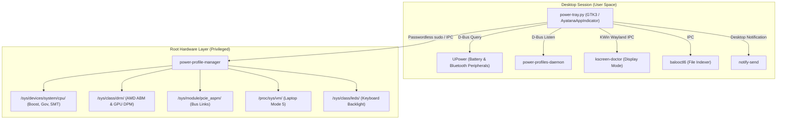

# 🏛️ Architecture & System Design

ThinkPower is built on a **Dual-Layer State Machine** designed to bridge the gap between Linux desktop standards and low-level hardware silicon power tuning.

---

## 1. The Core Problem: Profile Mismatch

The Linux desktop ecosystem standardizes power profiles through `power-profiles-daemon` (freedesktop.org specification, D-Bus interface `net.hadess.PowerProfiles`). 

This standard strictly hardcodes **three enum states**:
- `performance`
- `balanced`
- `power-saver`

Both the GNOME Control Center and KDE Plasma 6 (`org.kde.plasma.battery.so`) compile their user interfaces directly against this 3-state enumeration. Adding an arbitrary 4th profile ("Ultra Power Saver") to the system D-Bus protocol breaks specification compliance and cannot be rendered by native desktop widgets.

However, standard `power-saver` does **not** aggressively tune hardware silicon:
- Zen 2/3/4/5 APUs still boost cores up to 4.1GHz+ at 1.35V+ for micro-tasks.
- PCIe links remain in active power states.
- Display panels continue refreshing at full rate (60Hz / 120Hz / 144Hz).
- NVMe SSDs frequently wake up to flush small dirty disk buffers.

---

## 2. The Dual-Layer Solution

ThinkPower resolves this through a **two-tier architecture**:

```
[User Interface Layer (ThinkPower Tray)]
  │
  ├── ⚡ Performance  ────►  OS System Profile: "performance"
  ├── ⚖️ Balanced     ────►  OS System Profile: "balanced"
  ├── 🍃 Smart Save   ────►  OS System Profile: "power-saver"
  └── 🛡️ Ultra Save   ────►  OS System Profile: "power-saver" (Specialized Hardware Lock)
                                   │
                                   ▼
[Root Hardware Management Layer (power-profile-manager)]
  ├── CPU Frequency / Boost / SMT
  ├── GPU DPM / AMD ABM Panel Power Savings
  ├── Display Mode Engine (kscreen-doctor 48Hz / 60Hz)
  ├── PCIe ASPM Sub-state Links
  ├── Kernel VM I/O Flushing (Laptop Mode 5)
  └── Chassis EC / Keyboard Backlight Restoration
```

### State Mapping Table

| User Selection | OS System Profile (`powerprofilesctl`) | Hardware Execution Level |
| :--- | :--- | :--- |
| **⚡ Performance** | `performance` | Boost 4.1GHz ON, 60Hz, Baloo active, ABM 0 |
| **⚖️ Balanced** | `balanced` | Dynamic Boost, 60Hz, Baloo active, ABM 1, PCIe auto |
| **🍃 Smart Save** | `power-saver` | Boost OFF (1.7GHz max), 16T active, 60Hz, ABM 2, Wi-Fi/BT ON |
| **🛡️ Ultra Save** | `power-saver` | 1.4GHz lock, SMT 8T, 48Hz downclock, ABM 4, ASPM max, SSD sleep |

---

## 3. Bi-Directional D-Bus Synchronization

ThinkPower communicates with `power-profiles-daemon` over the system D-Bus:

1. **When changed via ThinkPower Tray**:
   - Updates local state in `~/.cache/power_profile_mode`.
   - Calls `powerprofilesctl set <target>` so KDE, Chrome, and system daemons recognize the state change.
   - Invokes `/usr/local/bin/power-profile-manager <target>` with passwordless sudo.
2. **When changed externally (e.g. AC adapter connected, KDE battery slider clicked)**:
   - ThinkPower listens for `PropertiesChanged` on `net.hadess.PowerProfiles`.
   - If external state becomes `performance` or `balanced`, ThinkPower immediately syncs its radio button and restores hardware.
   - If external state becomes `power-saver`, ThinkPower defaults to `Smart Save` (or preserves `Ultra Save` if already explicitly engaged).

---

## 4. Component Diagram


